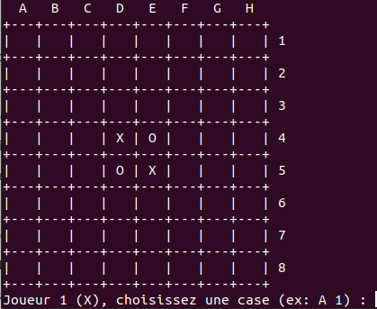

# Othello
Othello est un jeu de société sur un plateau, qui a était développé lors du 1er semestre de la L2 EEEA à l'UFR Sciences et Techniques du Madrillet.
Nous avons passé tout le semestre à développer nos compétences dans le langage C, ce jeu de plateau était la concrétisation de nos TPs, il apparaissait donc comme un TP, on avait 12h pour finaliser ce projet, qui était guidé. L'objectif était de le programmer en mode Console i.e sans interface graphique, mais avec un affichage du plateau de jeu dans le terminal.
## Compilation et lancement

gcc -o othello main.c partie.c partie.h plateau.c plateau.h

./othello

## Technologies
- Langage : C
- Compilation : GCC
- Interface : Terminal / Console

## Fonctionnalités
- Plateau 8x8 affiché dans le terminal
- Deux joueurs en local
- Voir règles de jeu sur mon portfolio

## Aperçu

